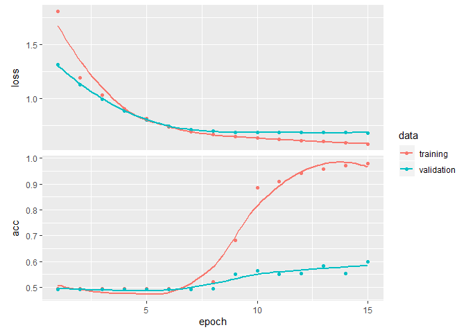

Comparing Multiple models on IMDB dataset
================
Anushree
2/21/2020

## 1\. Reading all pre-trained model files and test files

1.  First we load model files

<!-- end list -->

``` r
library(tidyverse)
library(keras)
library(reticulate)
library(plyr)
library(kableExtra)

#loading pre-trained models
simplernn_model=load_model_hdf5("simplernn_model.h5")
lstm_model=load_model_hdf5("lstm_model.h5")
gru_model=load_model_hdf5("gru_model.h5")
bilstm_model=load_model_hdf5("bilstm_model.h5")
bigru_model=load_model_hdf5("bigru_model.h5")
onedconv_model=load_model_hdf5("onedconv_model.h5")
```

2.  Next we load history files

<!-- end list -->

``` r
#loading pre-trained models history
simplernn_history=readRDS("simplernn_history.rds")
lstm_history=readRDS("lstm_history.rds")
gru_history=readRDS("gru_history.rds")
bilstm_history=readRDS("bilstm_history.rds")
bigru_history=readRDS("bigru_history.rds")
onedconv_history=readRDS("onedconv_history.rds")
```

3.  Next we load our test data set files

<!-- end list -->

``` r
x_test=readRDS("x_test.rds")
y_test=readRDS("y_test.rds")
```

## 2.Displaying Xtest and Ytest Statistics

1.  Number of reviews in test set:

<!-- end list -->

``` r
nrow(x_test)
```

    ## [1] 5000

2.  Number of positive reviews in test set:

<!-- end list -->

``` r
length(y_test[y_test==1])
```

    ## [1] 2487

3.  Number of negative reviews in test set:

<!-- end list -->

``` r
length(y_test[y_test==0])
```

    ## [1] 2513

## 3\. For each model:

1.  Summary of all models

# RNN Summary

``` r
summary(simplernn_model)
```

    ## Model: "sequential_3"
    ## ________________________________________________________________________________
    ## Layer (type)                        Output Shape                    Param #     
    ## ================================================================================
    ## embedding_3 (Embedding)             (None, None, 16)                80000       
    ## ________________________________________________________________________________
    ## simple_rnn (SimpleRNN)              (None, 16)                      528         
    ## ________________________________________________________________________________
    ## dense_3 (Dense)                     (None, 1)                       17          
    ## ================================================================================
    ## Total params: 80,545
    ## Trainable params: 80,545
    ## Non-trainable params: 0
    ## ________________________________________________________________________________

# Lstm Summary

``` r
summary(lstm_model)
```

    ## Model: "sequential_4"
    ## ________________________________________________________________________________
    ## Layer (type)                        Output Shape                    Param #     
    ## ================================================================================
    ## embedding_4 (Embedding)             (None, None, 32)                160000      
    ## ________________________________________________________________________________
    ## lstm (LSTM)                         (None, 32)                      8320        
    ## ________________________________________________________________________________
    ## dense_4 (Dense)                     (None, 1)                       33          
    ## ================================================================================
    ## Total params: 168,353
    ## Trainable params: 168,353
    ## Non-trainable params: 0
    ## ________________________________________________________________________________

# GRU Summary

``` r
summary(gru_model)
```

    ## Model: "sequential_5"
    ## ________________________________________________________________________________
    ## Layer (type)                        Output Shape                    Param #     
    ## ================================================================================
    ## embedding_5 (Embedding)             (None, None, 16)                80000       
    ## ________________________________________________________________________________
    ## gru_1 (GRU)                         (None, 16)                      1584        
    ## ________________________________________________________________________________
    ## dense_5 (Dense)                     (None, 1)                       17          
    ## ================================================================================
    ## Total params: 81,601
    ## Trainable params: 81,601
    ## Non-trainable params: 0
    ## ________________________________________________________________________________

# Bidirectional LSTM Summary

``` r
summary(bilstm_model)
```

    ## Model: "sequential_7"
    ## ________________________________________________________________________________
    ## Layer (type)                        Output Shape                    Param #     
    ## ================================================================================
    ## embedding_7 (Embedding)             (None, None, 30)                150000      
    ## ________________________________________________________________________________
    ## bidirectional_1 (Bidirectional)     (None, 60)                      14640       
    ## ________________________________________________________________________________
    ## dense_7 (Dense)                     (None, 1)                       61          
    ## ================================================================================
    ## Total params: 164,701
    ## Trainable params: 164,701
    ## Non-trainable params: 0
    ## ________________________________________________________________________________

# Bidirectional GRU Summary

``` r
summary(bigru_model)
```

    ## Model: "sequential_9"
    ## ________________________________________________________________________________
    ## Layer (type)                        Output Shape                    Param #     
    ## ================================================================================
    ## embedding_9 (Embedding)             (None, None, 16)                80000       
    ## ________________________________________________________________________________
    ## bidirectional_4 (Bidirectional)     (None, 32)                      3168        
    ## ________________________________________________________________________________
    ## dense_8 (Dense)                     (None, 1)                       33          
    ## ================================================================================
    ## Total params: 83,201
    ## Trainable params: 83,201
    ## Non-trainable params: 0
    ## ________________________________________________________________________________

# 1D convnet Summary

``` r
summary(onedconv_model)
```

    ## Model: "sequential_10"
    ## ________________________________________________________________________________
    ## Layer (type)                        Output Shape                    Param #     
    ## ================================================================================
    ## embedding_10 (Embedding)            (None, 300, 128)                640000      
    ## ________________________________________________________________________________
    ## conv1d (Conv1D)                     (None, 294, 32)                 28704       
    ## ________________________________________________________________________________
    ## max_pooling1d (MaxPooling1D)        (None, 58, 32)                  0           
    ## ________________________________________________________________________________
    ## conv1d_1 (Conv1D)                   (None, 52, 32)                  7200        
    ## ________________________________________________________________________________
    ## global_max_pooling1d (GlobalMaxPool (None, 32)                      0           
    ## ________________________________________________________________________________
    ## dense_9 (Dense)                     (None, 1)                       33          
    ## ================================================================================
    ## Total params: 675,937
    ## Trainable params: 675,937
    ## Non-trainable params: 0
    ## ________________________________________________________________________________

2.  Plotting History of all models \# RNN history

<!-- end list -->

``` r
plot(simplernn_history)
```

<!-- -->

# Lstm history

``` r
plot(lstm_history)
```

<!-- -->

# GRU history

``` r
plot(gru_history)
```

<!-- -->

# Bidirectional LSTM history

``` r
plot(bilstm_history)
```

<!-- -->

# Bidirectional GRU history

``` r
plot(bigru_history)
```

<!-- -->

# 1D convnet history

``` r
plot(onedconv_history)
```

<!-- -->

3.  Evaluating the performance of the model using the test set

# RNN Evaluation

``` r
simplernn_model %>% evaluate(x_test, y_test)
```

    ## $loss
    ## [1] 0.6736562
    ## 
    ## $acc
    ## [1] 0.7142

# Lstm Evaluation

``` r
lstm_model %>% evaluate(x_test, y_test)
```

    ## $loss
    ## [1] 0.8764958
    ## 
    ## $acc
    ## [1] 0.7186

# GRU Evaluation

``` r
gru_model %>% evaluate(x_test, y_test)
```

    ## $loss
    ## [1] 0.577702
    ## 
    ## $acc
    ## [1] 0.7638

# Bidirectional LSTM Evaluation

``` r
bilstm_model %>% evaluate(x_test, y_test)
```

    ## $loss
    ## [1] 0.4148151
    ## 
    ## $acc
    ## [1] 0.8204

# Bidirectional GRU Evaluation

``` r
bigru_model %>% evaluate(x_test, y_test)
```

    ## $loss
    ## [1] 0.4973578
    ## 
    ## $acc
    ## [1] 0.7806

# 1D convnet Evaluation

``` r
onedconv_model %>% evaluate(x_test, y_test)
```

    ## $loss
    ## [1] 0.6831348
    ## 
    ## $acc
    ## [1] 0.5896

## Summary of performance of different models

``` r
getMetrics <- function(model){
  res <- model %>% evaluate(x_test, y_test)
  acc <- res$acc
  class <- model %>% predict_classes(x_test)
  matrix <- table(y_test, class)
  n_tp <- matrix[2,2]
  n_tn <- matrix[1,1]
  n_fp <- matrix[1,2]
  n_fn <- matrix[2,1]
  metrics <- data.frame(acc,n_tp,n_tn,n_fp,n_fn)
  return (metrics)
}


models <- list(simplernn_model,lstm_model,gru_model,bilstm_model,bigru_model,onedconv_model)
modelname <- c("Simple RNN",
            "LSTM",
            "GRU",
            "Bidirectional LSTM",
            "Bidirectional GRU",
            "1D-Convent"
          
)

metrics <- ldply(models,getMetrics)
metrics_table <- cbind(model_name = modelname, metrics)


kable(metrics_table) %>%
  kable_styling(bootstrap_options = c("striped", "hover"))
```

<table class="table table-striped table-hover" style="margin-left: auto; margin-right: auto;">

<thead>

<tr>

<th style="text-align:left;">

model\_name

</th>

<th style="text-align:right;">

acc

</th>

<th style="text-align:right;">

n\_tp

</th>

<th style="text-align:right;">

n\_tn

</th>

<th style="text-align:right;">

n\_fp

</th>

<th style="text-align:right;">

n\_fn

</th>

</tr>

</thead>

<tbody>

<tr>

<td style="text-align:left;">

Simple RNN

</td>

<td style="text-align:right;">

0.7142

</td>

<td style="text-align:right;">

1134

</td>

<td style="text-align:right;">

2437

</td>

<td style="text-align:right;">

76

</td>

<td style="text-align:right;">

1353

</td>

</tr>

<tr>

<td style="text-align:left;">

LSTM

</td>

<td style="text-align:right;">

0.7186

</td>

<td style="text-align:right;">

2446

</td>

<td style="text-align:right;">

1147

</td>

<td style="text-align:right;">

1366

</td>

<td style="text-align:right;">

41

</td>

</tr>

<tr>

<td style="text-align:left;">

GRU

</td>

<td style="text-align:right;">

0.7638

</td>

<td style="text-align:right;">

1453

</td>

<td style="text-align:right;">

2366

</td>

<td style="text-align:right;">

147

</td>

<td style="text-align:right;">

1034

</td>

</tr>

<tr>

<td style="text-align:left;">

Bidirectional LSTM

</td>

<td style="text-align:right;">

0.8204

</td>

<td style="text-align:right;">

1888

</td>

<td style="text-align:right;">

2214

</td>

<td style="text-align:right;">

299

</td>

<td style="text-align:right;">

599

</td>

</tr>

<tr>

<td style="text-align:left;">

Bidirectional GRU

</td>

<td style="text-align:right;">

0.7806

</td>

<td style="text-align:right;">

2133

</td>

<td style="text-align:right;">

1770

</td>

<td style="text-align:right;">

743

</td>

<td style="text-align:right;">

354

</td>

</tr>

<tr>

<td style="text-align:left;">

1D-Convent

</td>

<td style="text-align:right;">

0.5896

</td>

<td style="text-align:right;">

1592

</td>

<td style="text-align:right;">

1356

</td>

<td style="text-align:right;">

1157

</td>

<td style="text-align:right;">

895

</td>

</tr>

</tbody>

</table>

## Results:

1.  From the above table, it can be seen that the accuracy of the two
    Bidirectional models is the best with the accuracy of Bidirectional
    LSTM being number one and bidirectional gru being number two.
    Bidirectional Gru is followed by Gru, LSTM and RNN which have almost
    the same accuracy. 1d-Convent performs the worst in terms of
    accuracy. So on the basis of accuracy alone Bidirectional LSTM would
    be the best model for predicting reviews for the IMDB datase.t

2.  It can also be seen from the table that LSTM has the highest number
    of true-positives and lowest number of false negatives. That means
    that its actual-positives(True positive+false negative) are just
    more by 41. i.e the model just didn’t correctly identify 41 positive
    reviews as positive which makes it the most sensitive model. As
    compared to other models which have a greater variation in their
    actual positives and true positives. The greatest variation in false
    negative and true positive is in the simple RNN model making it the
    least sensitive model.

3.  It can also be observed that simple rnn has the least number of
    false positives which is 76. Which means it has the last number of
    incorrectly labelled positive reviews, making it the most precise.
    While 1d-convenent has the most number of incorrectly identified
    positive reviews which is 1157.1D convent has very little variance
    in correctly idenentified positive reviews and reviews which were
    negative but identified as positive, making it the least precise.
